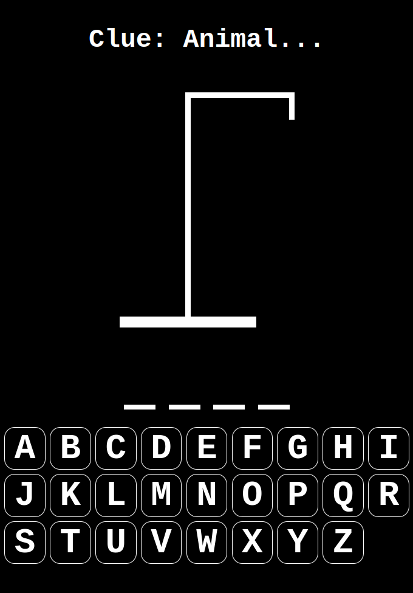
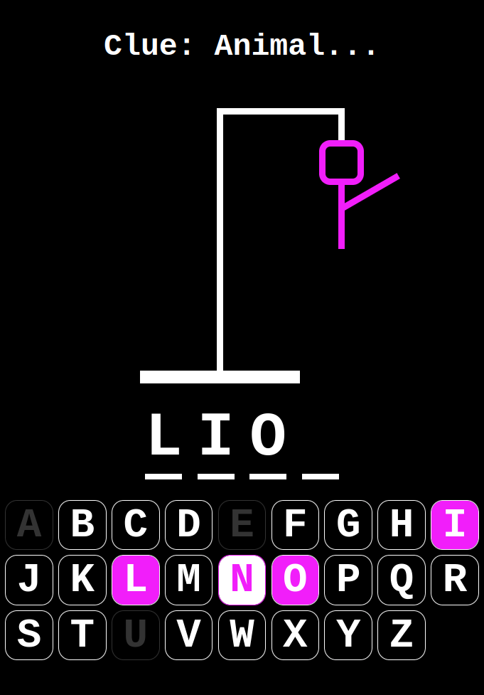
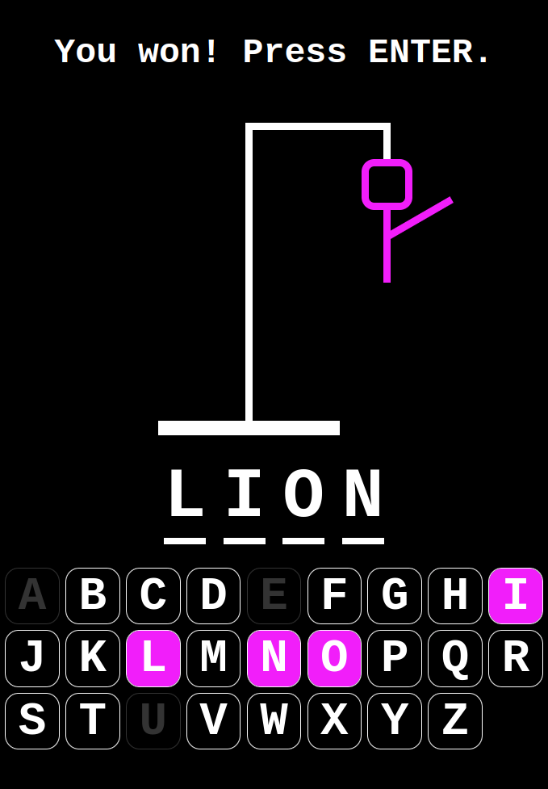
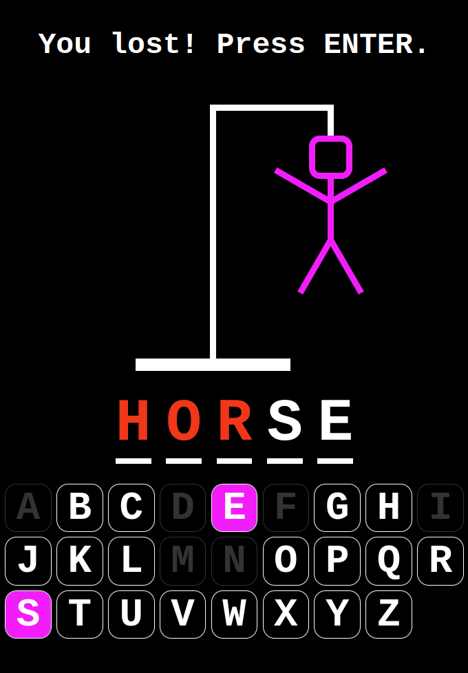

# Hangman Game (React.js / TypeScript)

  
    

## About

- Hands-on learning of React (with custom types via TypeScript)
- Step by step (frequent [commits](https://github.com/44jovi/hangman-react-ts/commits/main)) build based on an existing [project](https://github.com/WebDevSimplified/react-hangman) by Kyle Cook of WDS

## Key Learnings

- React compmonents and props
- React hooks
  - useState()
  - useEffect()
  - useCallback()
- preventDefault()
- React iterator keys

---

  
  
  
  

